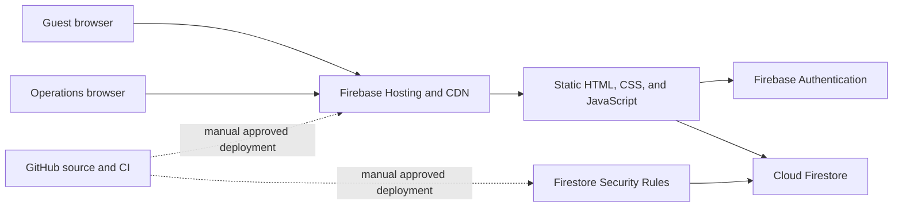

# AlphaOpen architecture

## Purpose and scope

AlphaOpen is a responsive tennis-league web application for guests, players, Captains, Neutral Approvers, EC members, and Super Admins. It manages identity, season setup, rosters, lineups, approvals, scheduling, scoring, standings, public dashboards, and historical views.

This document describes the deployed architecture as of August 2026. Product requirements remain in `ALPHAOPEN_APP_SPEC.md`; record-level details remain in `FIRESTORE_DATA_MODEL.md`.

## System context

There is no application server rendering HTML. Firebase Hosting serves the static application. Reads and authorized administrative writes go directly from the browser to Firestore and are enforced by `firestore.rules`. No Cloud Functions are currently deployed in DEV or PROD; PROD's Cloud Functions API is disabled.

## Environments

| Environment | Firebase project | URL | Purpose |
| --- | --- | --- | --- |
| DEV | `alphaopen-development-2026` | `https://alphaopen-development-2026.web.app` | Initial integration testing |
| UAT | `alphaopen-test-system` | `https://alphaopen-test-system.web.app` | Product-owner acceptance |
| PROD | `alphaopen-production` | `https://alphaopen-production.web.app` and custom domains | Live league operation |

Aliases are defined in `.firebaserc`, but every deployment command must still specify `--project`.

## Runtime layers

### Presentation and navigation

- `index.html` contains the page shell, dialogs, forms, and primary script references.
- `styles.css` and the consistency stylesheets provide responsive presentation.
- `app.js` owns route changes, shared UI state, basic page behavior, and public dashboard rendering.
- `runtime-loader.js` loads role- and route-specific modules only when needed.
- Bootstrap files connect page controls to feature modules without bundling.

### Firebase connection and identity

- `firebase-client.js` obtains Firebase Hosting's automatic project configuration and rejects unexpected host/project combinations.
- `firebase-auth.js` resolves the signed-in identity and Operations authorization.
- `player-identity.js` resolves canonical Player IDs and display names.
- Browser modules use one shared Firebase application instance.

### Feature modules

| Area | Principal files |
| --- | --- |
| Public data and history | `firebase-data.js`, `public-season-dashboard.js`, `season-public-sync.js` |
| Players and identities | `player-admin.js`, `player-identity.js`, `identity-reconciliation.js` |
| Operations access | `operations-access-admin.js`, `lineup-approver-admin.js` |
| Season setup | `season-bulk-import.js`, `season-operations.js`, `season-structure-admin.js`, `season-reset.js` |
| Rosters | `roster-admin-v3.js` |
| Lineups | `lineup-submit.js`, `lineup-approve.js`, `lineup-update.js`, `lineup-reset.js` |
| Scheduling and scores | `match-management.js`, `score-rules.js`, `poster-generator.js` |
| Venues and AO content | `venue-admin.js`, `ao-content.js` |

Older roster and lineup modules remain in the repository for compatibility or migration history; new changes should target the currently loaded version identified by `runtime-loader.js`.

### Inactive Functions source

`functions/src/index.js` contains callable-Function source and `functions/src/workflow.js` contains reusable lineup validation/status logic. This source is retained for testing and possible future migration, but it is not part of the deployed runtime: `firebase.json` has no Functions deployment target, DEV has no deployed Functions, and the PROD Functions API is disabled. Do not deploy this source until dependencies, App Check, Firebase configuration, and DEV/UAT behavior receive an explicit production-readiness review.

### Offline and cache behavior

`service-worker.js` maintains a versioned application-shell cache. A changed browser-loaded module must receive a query-string version bump in all references, and the service-worker cache name must also change. `pwa.js` registers the worker. Firebase Hosting sends `no-cache` for HTML, JavaScript, CSS, the manifest, and the service worker so clients revalidate.

## Data architecture

Firestore is the system of record. Major boundaries are:

- Global private masters: players, venues, Operations access, users, and identity links.
- Season-private records: members, teams, rosters, weeks, matchups, lineups, line matches, standings, and audits.
- Public projections: active/completed season dashboards, public player directory, AO content, and public configuration.

Public pages read deliberately reduced public documents. Private master records must never be queried by guests. Stable Player, Season, Team, Matchup, and Line Match IDs preserve history when names change.

## Critical workflows

### Sign-in and authorization

1. Firebase Authentication verifies Google identity.
2. The client reads approved Operations access and user/season membership.
3. The UI exposes only applicable tools.
4. Firestore rules independently authorize every direct read/write.

UI visibility is not a security control; Firestore rules are authoritative for the currently deployed direct-write architecture.

### Lineup lifecycle

Captain submission → backend validation → opponent submission → Neutral Approver review → simultaneous publication → controlled correction/reset. The backend enforces five lines, active roster membership, unique players, rank restrictions, and SOR ordering.

### Schedule and score lifecycle

Approved players are locked into each Line Match. Authorized Captains or EC members set venue/time and score. `score-rules.js` derives the winner and league points. Public projections are refreshed after official changes.

### Player email reuse

Active Operations access continues to reserve an email. Revoked access releases it for another Player ID while preserving prior assignment metadata in `revokedAssignmentHistory`.

## Security boundaries

- `firestore.rules` is the primary control for browser Firestore access.
- Browser transactions repeat workflow validation for usability and consistency, but they do not replace Firestore rule enforcement.
- PROD, UAT, and DEV project IDs are explicitly mapped by hostname.
- Firebase SDK modules are loaded from Google's CDN.
- Secrets and service-account keys are not stored in the repository.
- Super Admin operations and destructive season actions require additional confirmation.

## Build, test, and release architecture

- `npm run lint` checks JavaScript syntax and JSON parsing.
- `npm test` runs repository regression guards, critical pure-workflow tests, and Functions tests.
- `npm run build` creates a deployable static artifact in `dist/` and validates local HTML/service-worker references.
- `.github/workflows/ci.yml` runs those checks for pushes and pull requests.
- CI does not contain Firebase credentials and cannot deploy.
- Approved releases are deployed manually with Firebase CLI, by scope and explicit project ID.

## Change-impact guide

| Change | Usually update | Required checks |
| --- | --- | --- |
| Page content/layout | HTML/CSS/module, version references, service-worker cache | Lint, regression, build, visual DEV/UAT |
| Browser module behavior | Feature module, loader version, service-worker version | Unit/regression tests and role-based DEV/UAT |
| Firestore access | `firestore.rules` and rule tests | Emulator/security tests, unauthorized-user negative tests |
| Data shape | Data model, readers, writers, exports/imports, rules | Backup, migration plan, DEV/UAT data test |
| Dormant Function source | `functions/src`, Firebase configuration, client integration | Dependency/security review, Functions tests, App Check plan, DEV/UAT callable test before any deployment |
| Public projection | Publisher, reader, rules | Guest/private-data review and refresh test |

## Operational ownership

The product owner approves behavior and PROD releases. A technical maintainer prepares code, tests, deployment scope, and rollback point. A Super Admin performs controlled data operations. No one should combine a behavior change, unreviewed data migration, and production deployment into one undocumented step.
